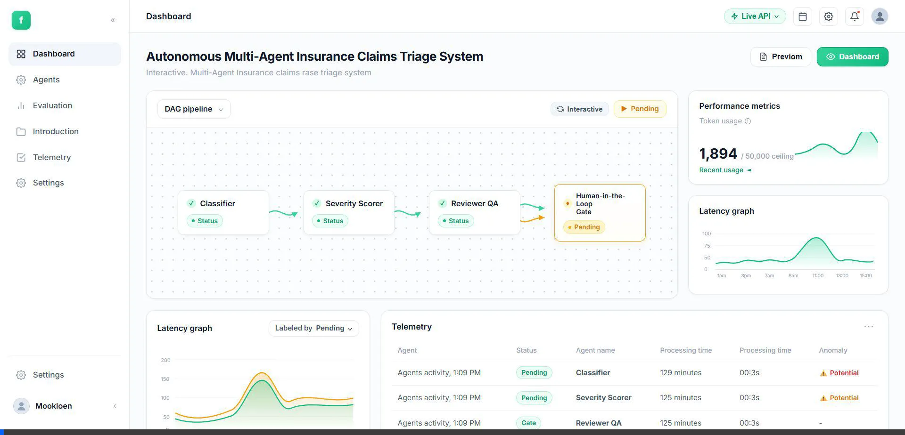
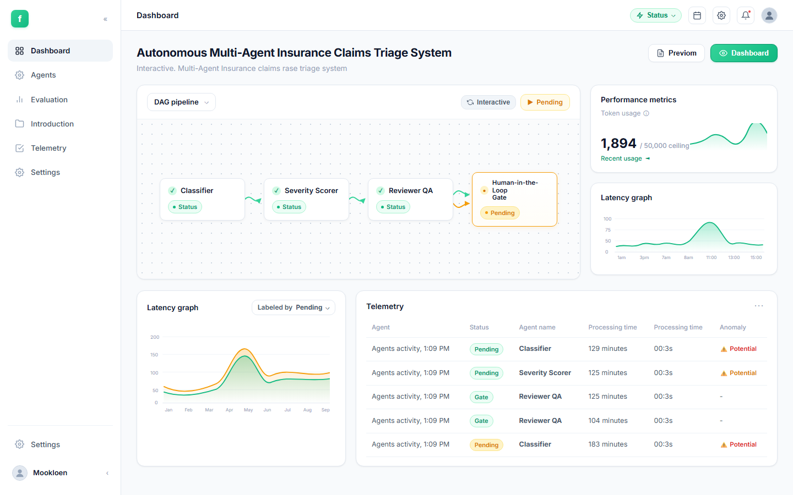
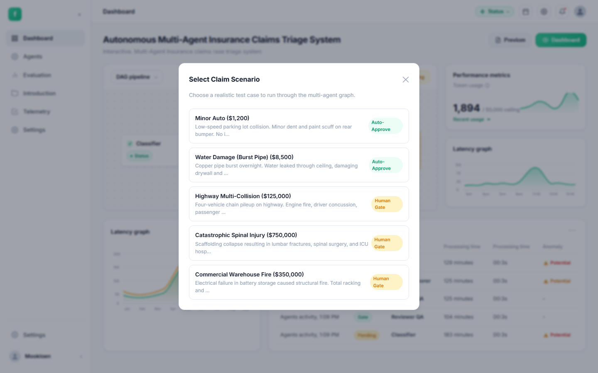
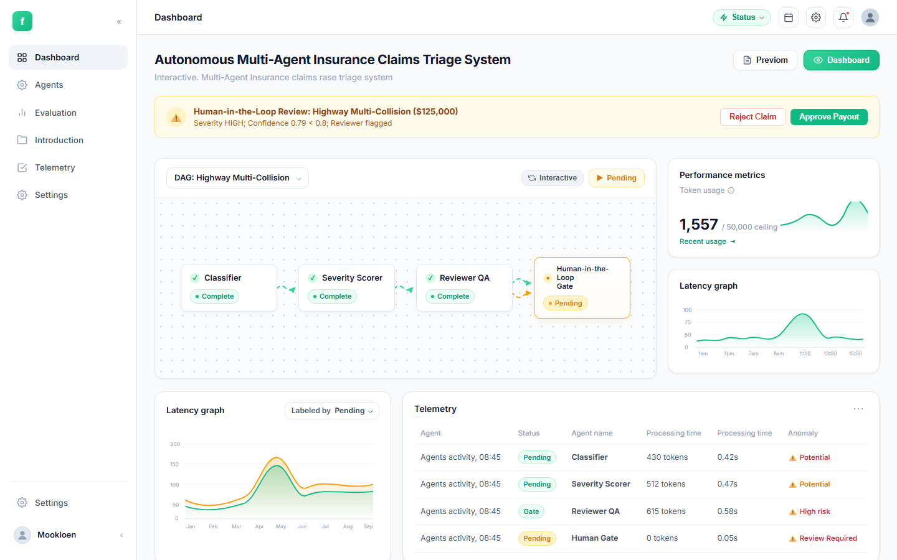
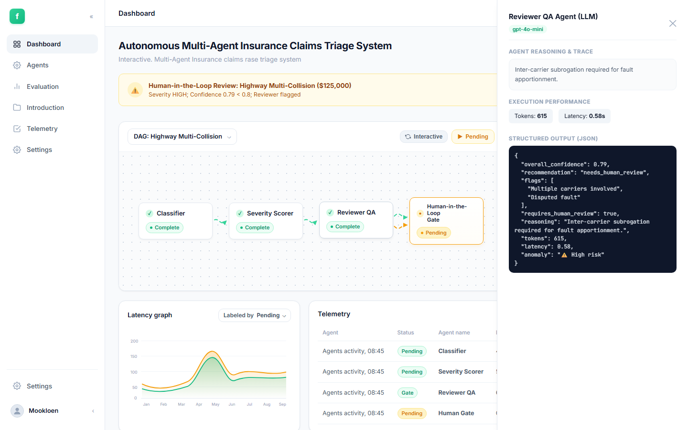
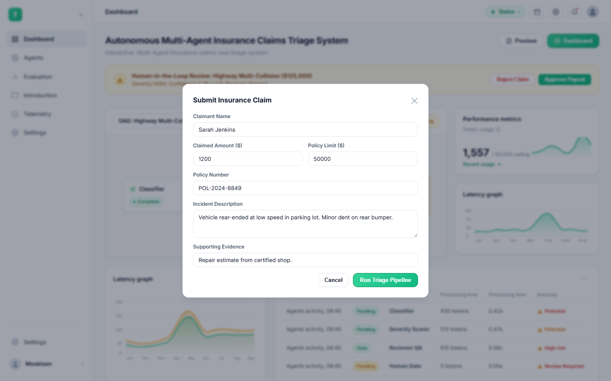

# 🏥 Autonomous Multi-Agent Insurance Claims Triage System

[](https://www.python.org/downloads/)
[](https://github.com/langchain-ai/langgraph)
[](https://fastapi.tiangolo.com/)
[](https://redis.io/)
[](https://www.postgresql.org/)
[](https://www.docker.com/)
[](LICENSE)

> **Autonomous Multi-Agent AI System for Insurance Claims**: Real-time triage, intelligent severity scoring, automated fraud/risk detection, crash-resilient Redis checkpointing, and deterministic Human-in-the-Loop governance.

---

## 📑 Table of Contents

- [Overview](#-overview)
- [System Architecture](#-system-architecture)
- [Live Video Demo](#-live-video-demo)
- [Interactive UI Showcase](#-interactive-ui-showcase)
- [How It Works (Agent Workflow)](#-how-it-works-agent-workflow)
- [Key Safety & Production Features](#-key-safety--production-features)
- [API Reference](#-api-reference)
- [Quick Start Guide](#-quick-start-guide)
  - [Prerequisites](#prerequisites)
  - [Running with Docker Compose (Recommended)](#running-with-docker-compose-recommended)
  - [Local Development Setup](#local-development-setup)
- [Running Test Suite](#-running-test-suite)
- [Repository Structure](#-repository-structure)
- [Configuration Reference](#-configuration-reference)
- [License](#-license)

---

## 🌟 Overview

Processing insurance claims manually is slow, labor-intensive, and prone to inconsistency. This platform demonstrates an enterprise-grade **Multi-Agent Directed Acyclic Graph (DAG)** built on **LangGraph**, **FastAPI**, **Redis**, and **PostgreSQL**.

Every incoming claim flows through specialized LLM-powered agents that:
1. **Classify** the peril type (Auto, Property, Bodily Injury, Commercial).
2. **Score severity & estimate payouts** while identifying hidden risk factors.
3. **Audit & Review QA** to cross-validate policy limits against estimates and assign a confidence score.
4. **Route safely via Human Gate**: High-confidence, low-severity claims are auto-approved in milliseconds, while complex, catastrophic, or suspicious claims trigger an immediate **Human-in-the-Loop (HITL)** approval workflow.

---

## 🏗️ System Architecture

```
                                  INCOMING CLAIM
                                        │
                                        ▼
                             ┌─────────────────────┐
                             │   FastAPI Gateway   │
                             └──────────┬──────────┘
                                        │
                         ┌──────────────▼──────────────┐
                         │   LangGraph State Machine   │
                         │                             │
                         │    ┌───────────────────┐    │
                         │    │ 1. Classifier     │    │  (GPT-4o-mini)
                         │    └─────────┬─────────┘    │  Categorize claim & sub-perils
                         │              │              │
                         │    ┌─────────▼─────────┐    │
                         │    │ 2. Severity Score │    │  (GPT-4o-mini)
                         │    └─────────┬─────────┘    │  Assess damage & risk factors
                         │              │              │
                         │    ┌─────────▼─────────┐    │
                         │    │ 3. Reviewer QA    │    │  (GPT-4o-mini)
                         │    └─────────┬─────────┘    │  Compute confidence & sanity check
                         │              │              │
                         │    ┌─────────▼─────────┐    │
                         │    │ 4. Human Gate     │    │  (Deterministic Logic)
                         │    └────┬─────────┬────┘    │  Severity High OR Conf < 0.8?
                         └─────────┼─────────┼─────────┘
                                   │         │
                   ┌───────────────┘         └───────────────┐
                   ▼                                         ▼
         [ AUTO-APPROVE ]                          [ HUMAN REVIEW REQUIRED ]
    Instant Payout Authorized                Suspended in Postgres & Flagged in Dashboard
                   │                                         │
                   └───────────────────┬─────────────────────┘
                                       │
                         ┌─────────────┴─────────────┐
                         │    Persistence & State    │
                         │                           │
                         │   • Redis: Checkpoints    │  (Crash-recovery at every step)
                         │   • Postgres: Audit Traces│  (Token usage, latency, decisions)
                         └───────────────────────────┘
```

---

## 🎬 Live Video Demo

Watch the autonomous multi-agent pipeline execute live: from ingestion and classification, through severity scoring and reviewer QA confidence evaluation, to deterministic Human-in-the-Loop adjudication and instant auto-approval.



---

## 🖥️ Interactive UI Showcase

The system includes a responsive, high-performance web dashboard providing complete transparency into the multi-agent graph, agent reasoning, execution traces, and manual approvals.

### 1. Multi-Agent DAG Dashboard Overview
Real-time visualization of the agent graph pipeline with step status indicators, token consumption gauges against the 50,000 budget ceiling, and live telemetry.



---

### 2. Pre-configured Scenarios & Benchmark Suite
Switch effortlessly between test claims ranging from straightforward auto fender benders to complex multi-car pileups and catastrophic injury cases.



---

### 3. Human-in-the-Loop (HITL) Decision Banner
When a claim is flagged as high severity or has confidence below `0.80`, the graph pauses execution and alerts adjusters with full contextual reasoning and one-click Approve/Reject controls.



---

### 4. Deep Agent Inspector & Reasoning Trace
Inspect every agent's thought process, latency breakdown, token consumption, and validated Pydantic JSON payload directly in the sliding inspector drawer.



---

### 5. Custom Claim Submission Interface
Interactive form allowing insurance adjusters or policyholders to submit live claims with custom policy limits, damage reports, and supporting documents.



---

## 🤖 How It Works (Agent Workflow)

| Agent | Technology | Role & Objective |
| :--- | :--- | :--- |
| **1. Classifier** | LLM (`gpt-4o-mini`) | Parses unstructured description, extracts incident peril, tags sub-category (e.g., `water_damage`, `multi_vehicle`, `catastrophic_bodily`). |
| **2. Severity Scorer** | LLM (`gpt-4o-mini`) | Predicts total estimated payout, assesses tier (`low`, `medium`, `high`), and lists actionable risk factors (e.g., `litigation risk`, `subrogation`). |
| **3. Reviewer QA** | LLM (`gpt-4o-mini`) | Validates estimated payout against policy limits, evaluates consistency, flags ambiguities, and produces an overall confidence score (0.0 to 1.0). |
| **4. Human Gate** | Deterministic Rule Engine | Inspects triage results. If `severity == high` OR `confidence < 0.80` OR reviewer flagged human review, routes claim to human queue; otherwise executes instant auto-approval. |

---

## 🛡️ Key Safety & Production Features

### 🔄 Crash Recovery with Redis Checkpointing
- Every single state transition in LangGraph is serialized and snapshotted to Redis.
- If a server worker crashes or power fails mid-triage, the claim can be resumed immediately with `POST /claims/resume/{id}` without re-running completed agents or incurring duplicate LLM costs.

### 🛑 Hard Token & Time Budget Ceilings
- **Token Ceiling**: Enforces a strict maximum of **50,000 tokens** per claim.
- **Time Ceiling**: Hard timeout set to **300 seconds (5 minutes)**.
- If a budget breach occurs, the claim gracefully transitions to `BUDGET_EXCEEDED` status, preserving all partial traces.

### 🔍 Complete Traceability & Step-Level Logging
- Every single step records:
  - Agent name & timestamp
  - Latency in milliseconds
  - Exact token count used
  - Raw inputs and structured output models
  - Chain-of-thought reasoning explanation

---

## 📡 API Reference

Interactive OpenAPI documentation is available at `/docs` when the server is running.

| Method | Endpoint | Description |
| :--- | :--- | :--- |
| `GET` | `/` | Serves the interactive web dashboard |
| `POST` | `/claims` | Submit a new insurance claim for triage |
| `GET` | `/claims/{id}` | Get real-time status and agent outputs |
| `GET` | `/claims/{id}/trace` | Retrieve complete decision tree and agent trace logs |
| `GET` | `/pending_approvals` | List claims awaiting human adjuster review |
| `POST` | `/approve/{id}` | Submit human adjuster decision (`approve` or `reject`) |
| `POST` | `/claims/resume/{id}` | Resume an interrupted claim from last Redis checkpoint |
| `GET` | `/checkpoints` | List active checkpoints in Redis |
| `GET` | `/health` | Application and dependency health check |

### Example: Submit a Claim via cURL

```bash
curl -X POST http://localhost:8000/claims \
  -H "Content-Type: application/json" \
  -d '{
    "description": "Vehicle rear-ended at intersection causing whiplash and bumper damage",
    "policy_number": "POL-2024-001234",
    "policy_limit": 100000,
    "claimant_name": "John Smith",
    "incident_date": "2024-11-15",
    "claimed_amount": 15000,
    "supporting_info": "Police report filed"
  }'
```

---

## 🚀 Quick Start Guide

### Prerequisites
- **Python 3.11+**
- **Docker & Docker Compose** (optional, recommended)
- **OpenAI API Key**

---

### Running with Docker Compose (Recommended)

1. **Clone the repository:**
   ```bash
   git clone https://github.com/GhassenAllouch11236598989898/Claim_Tirage_system.git
   cd Claim_Tirage_system
   ```

2. **Configure your environment:**
   ```bash
   cp .env.example .env
   # Open .env and insert your OPENAI_API_KEY
   ```

3. **Start all services (FastAPI, Redis, PostgreSQL):**
   ```bash
   docker compose up --build
   ```

4. **Access the application:**
   - 🌐 **Dashboard UI**: [http://localhost:8000](http://localhost:8000)
   - 📚 **Swagger Docs**: [http://localhost:8000/docs](http://localhost:8000/docs)
   - 📊 **Health Check**: [http://localhost:8000/health](http://localhost:8000/health)

---

### Local Development Setup

If you prefer running without Docker containers:

1. **Create and activate a virtual environment:**
   ```bash
   python -m venv .venv
   # Windows:
   .venv\Scripts\activate
   # Linux/macOS:
   source .venv/bin/activate
   ```

2. **Install dependencies:**
   ```bash
   pip install -r requirements.txt
   ```

3. **Ensure Redis and PostgreSQL are running locally:**
   - Redis on `localhost:6379`
   - PostgreSQL on `localhost:5432` with database `claims_triage` (schema from `claims_triage/init.sql`)

4. **Run the FastAPI server:**
   ```bash
   uvicorn claims_triage.api:app --host 0.0.0.0 --port 8000 --reload
   ```

---

## 🧪 Running Test Suite

### 1. Unit Tests (Isolated, Mocked LLM & DB)
Runs fast without external network or container dependencies:
```bash
pytest claims_triage/tests/test_unit.py -v
```

### 2. Integration Tests (End-to-End Multi-Scenario Benchmark)
Evaluates the entire pipeline through 5 diverse real-world claim profiles:
```bash
python claims_triage/tests/test_integration.py
```

---

## 📂 Repository Structure

```
Claim_Tirage_system/
├── claims_triage/
│   ├── __init__.py           # Package initialization
│   ├── config.py             # Pydantic Settings loaded from env
│   ├── models.py             # 17 Pydantic schemas for agents, claims, traces
│   ├── agents.py             # 4 specialized agents (Classifier, Scorer, Reviewer, Gate)
│   ├── graph.py              # LangGraph state machine & routing logic
│   ├── checkpointing.py      # Redis crash recovery & state serialization
│   ├── budget.py             # Token counter & timeout budget enforcement
│   ├── tracing.py            # Step-level latency & reasoning audit logger
│   ├── database.py           # Async SQLAlchemy ORM, engine & CRUD
│   ├── api.py                # FastAPI endpoints, background tasks & static mount
│   ├── init.sql              # PostgreSQL DDL schema & indexes
│   ├── static/               # Interactive web dashboard
│   │   ├── index.html        # Modern UI layout & components
│   │   ├── styles.css        # Responsive styling & DAG canvas theme
│   │   └── app.js            # Scenario runner, telemetry & API client
│   └── tests/
│       ├── test_unit.py      # Unit test suite with mock fixtures
│       └── test_integration.py # End-to-end integration tests
├── screenshots/              # UI captures used in documentation
│   ├── 01_dashboard_pipeline.png
│   ├── 02_scenarios_modal.png
│   ├── 03_human_in_the_loop.png
│   ├── 04_agent_inspector.png
│   └── 05_new_claim_form.png
├── Dockerfile                # Multi-stage production container
├── docker-compose.yml        # Orchestration for FastAPI + Postgres + Redis
├── requirements.txt          # Python dependencies
├── .env.example              # Environment variables template
├── .gitignore                # Git ignore configuration
└── README.md                 # Project documentation
```

---

## ⚙️ Configuration Reference

All settings can be customized in `.env` or passed as container environment variables:

| Variable | Type | Default | Description |
| :--- | :--- | :--- | :--- |
| `OPENAI_API_KEY` | `str` | `""` | **Required**: OpenAI API authorization key |
| `OPENAI_MODEL` | `str` | `gpt-4o-mini` | LLM model used for classification, scoring, and review |
| `OPENAI_TEMPERATURE` | `float` | `0.1` | Temperature for deterministic outputs |
| `MAX_TOKENS` | `int` | `50000` | Hard budget ceiling of tokens per claim execution |
| `MAX_WALL_CLOCK_SECONDS` | `float` | `300.0` | Maximum execution time in seconds (5 minutes) |
| `HUMAN_GATE_CONFIDENCE_THRESHOLD` | `float` | `0.80` | Claims with confidence below this require human review |
| `HUMAN_GATE_SEVERITY_TRIGGER` | `str` | `high` | Severity tier that automatically triggers human gate |
| `REDIS_HOST` | `str` | `localhost` | Redis server hostname |
| `REDIS_PORT` | `int` | `6379` | Redis port |
| `POSTGRES_HOST` | `str` | `localhost` | PostgreSQL server hostname |
| `POSTGRES_PORT` | `int` | `5432` | PostgreSQL server port |
| `POSTGRES_DB` | `str` | `claims_triage` | Database name |
| `POSTGRES_USER` | `str` | `claims_user` | Database username |
| `POSTGRES_PASSWORD` | `str` | `claims_pass` | Database user password |

---

## 📄 License

This project is open-source software licensed under the [MIT License](LICENSE).
